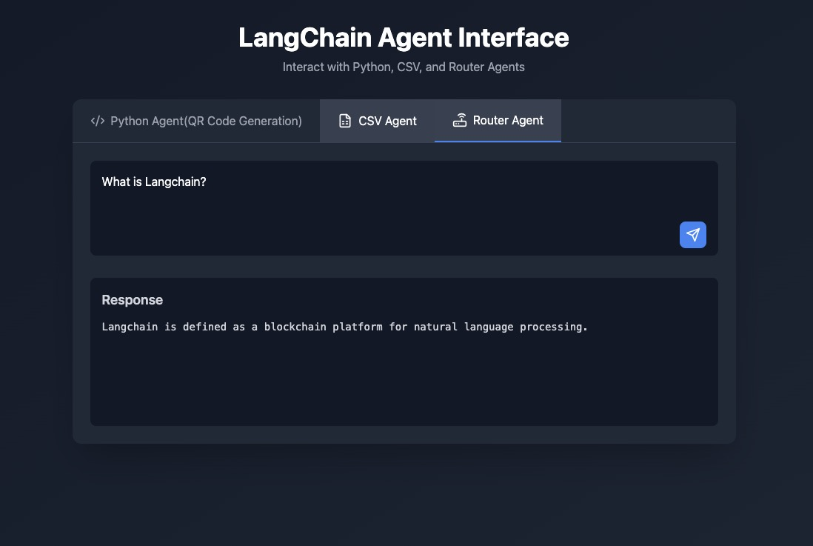

## 🚀 Features

- **QR Code Generation**: Create ASCII-based QR codes directly in the output
- **CSV Data Analysis**: Process and analyze CSV files using natural language queries
- **Intelligent Routing**: Smart request routing between different AI agents

### Frontend
- React
- Vite
- ESLint for code quality

### Backend
- Flask
- LangChain
- OpenAI GPT-3.5
- Python 3.x

## 🔧 Installation

1. **Install Frontend Dependencies**
   ```bash
   npm install
   ```

2. **Install Backend Dependencies**
   ```bash
   pip install -r requirements.txt
   ```

3. **Environment Setup**
   ```bash
   # Create a .env file in the root directory
   touch .env

   # Add your OpenAI API key
   OPENAI_API_KEY=your_api_key_here
   ```

- **Development Mode**
  ```bash
  pnpm dev
  ```
  This command starts both the Vite development server and the Flask backend concurrently.

- **Build for Production**
  ```bash
  npm run build
  ```
  Builds the frontend app for production to the `dist` folder.


## 📝 Notes

- The backend server runs on port 5000 by default
- The frontend development server runs on the default Vite port (typically 5173)
- Make sure to keep your OpenAI API key confidential
- The CSV analysis feature expects a file named `episode-info.csv` in the parent directory
